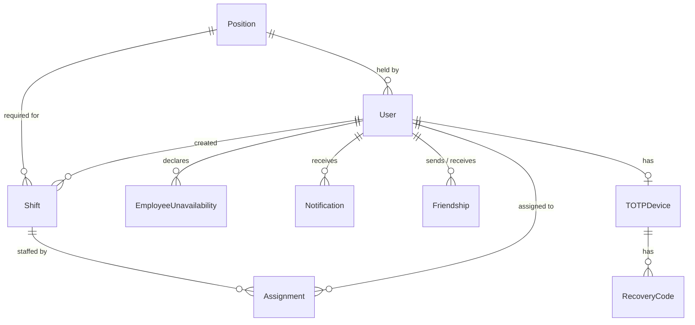

*This project has been created as part of the 42 curriculum by dtereshc, olcherno, ntsvetko.*

# ft_transcendence

## Description

**ft_transcendence** is a shift-scheduling web application for hourly-employment teams such as coffee
shops, restaurants and retail.

**Goal.** Building a rota by hand is mostly conflict-checking: does this person hold the right
position, are they already booked, did they ask for the day off, is the shift over capacity?
ft_transcendence moves these checks to the server, inside the transaction that saves a shift, so an
invalid schedule can never be written to the database.

**Overview.** An admin manages accounts and approves registrations. Managers build one shared
schedule on an interactive calendar, drafting shifts, assigning staff and publishing a date range
in one action. Employees see only the published shifts they are assigned to and mark the days they
are unavailable. Every change reaches the other connected users in real time.

### Key features

- Month and week calendar with a draft/publish workflow.
- Four scheduling rules enforced server-side: position match, capacity, availability, no overlap.
- Four roles (admin, manager, employee, guest), each with its own pages and actions.
- Real-time updates over WebSockets: live schedule, presence of other managers, online status.
- Shift search with filters, sorting and pagination.
- Analytics dashboard with charts, CSV/PDF export and live refresh.
- Notifications for every creation, update and deletion, with a history behind a bell.
- Profiles with avatars, friends and online status.
- Two-factor authentication (TOTP) with recovery codes.
- English, Czech and Arabic, with a full right-to-left layout for Arabic.
- GDPR self-service: data export and account deletion with email confirmation.
- HTTPS everywhere; Privacy Policy and Terms of Service linked from every page.

## Instructions

### Prerequisites

| Software | Version |
|---|---|
| Docker Engine | 24+ |
| Docker Compose | v2 |

Nothing else is needed: the image builds the front end, applies migrations, seeds demo data and
generates a TLS certificate on first start.

### Step by step

1. Clone the repository and enter it:

   ```bash
   git clone <repository-url> ft_transcendence
   cd ft_transcendence
   ```

2. Create the environment file from the template:

   ```bash
   cp .env.example .env
   ```

3. Replace `SECRET_KEY` in `.env` with a random value, for example the output of:

   ```bash
   python3 -c "import secrets; print(secrets.token_urlsafe(64))"
   ```

4. Build and start the whole stack with one command:

   ```bash
   docker compose up --build
   ```

5. Open **<https://localhost:8443/>**. The certificate is self-signed, so the browser shows a
   warning: choose **Advanced → Proceed to localhost**. Plain HTTP on port 8080 redirects to HTTPS.

To stop: `Ctrl-C`, then `docker compose down` (add `-v` to also delete the database).

### Environment variables (`.env`)

`.env` is ignored by Git and Docker; `.env.example` is the committed template and works as-is.

| Variable | Purpose |
|---|---|
| `SECRET_KEY` | Django signing key — must be changed |
| `DEBUG` | `0` for evaluation |
| `ALLOWED_HOSTS`, `CSRF_TRUSTED_ORIGINS` | Hosts and origins the app accepts |
| `TIME_ZONE` | Timezone of shift times |
| `SECURE_COOKIES`, `SECURE_HSTS_SECONDS` | HTTPS-only cookies and HSTS lifetime |
| `HTTPS_PORT`, `HTTP_PORT` | Ports published by the nginx proxy (8443 / 8080) |
| `SEED_DEMO_DATA` | Create demo positions, staff and shifts on start |
| `ENABLE_DEMO_LOGIN` | Show one-click demo login buttons |
| `EMAIL_*`, `DEFAULT_FROM_EMAIL` | Email delivery; by default emails are printed to `docker compose logs web` |

### Demo accounts

Created on start while `SEED_DEMO_DATA=1`, all with the password `demo12345!`:

| Role | Email |
|---|---|
| Admin | `admin_demo@example.com` |
| Manager | `manager_demo@example.com` |
| Employee | `employee_demo@example.com` |

## Resources

- [Django documentation](https://docs.djangoproject.com/en/stable/) — models, forms, authentication,
  internationalisation and the [security guide](https://docs.djangoproject.com/en/stable/topics/security/)
- [Django Channels documentation](https://channels.readthedocs.io/) — consumers, groups, channel layers
- [React documentation](https://react.dev/learn)
- [Vite guide](https://vite.dev/guide/)
- [Tailwind CSS v4 documentation](https://tailwindcss.com/docs)
- [nginx: configuring HTTPS servers](https://nginx.org/en/docs/http/configuring_https_servers.html)
- [MDN Web Docs](https://developer.mozilla.org/) — WebSockets, CSS logical properties, `dir` attribute
- [OWASP Cheat Sheet Series](https://cheatsheetseries.owasp.org/) — authentication and password storage
- [RFC 6238 — TOTP](https://datatracker.ietf.org/doc/html/rfc6238)
- [GDPR text](https://gdpr-info.eu/)
- [The Twelve-Factor App: Config](https://12factor.net/config)

### Use of AI

AI was not used to write the project's code — all code was written by the team members themselves.
AI was used only as a supporting tool, for:

- **Research** — looking up and comparing approaches, and explaining documentation for the
  technologies above (Django Channels, TOTP, RTL layout, GDPR requirements).
- **Documentation** — help with structuring and wording this README and other project notes.
- **Bug checking** — reviewing code the team had written to point out possible bugs and edge cases;
  every fix was then written and tested by the team.

## Team Information

| Member | Role(s) | Responsibilities |
|---|---|---|
| `dtereshc` | Tech Lead / Architect, Developer | Defines the architecture and the technology stack, ensures code quality, reviews critical changes. Builds the User model, authentication, the scheduling rule engine, Docker/TLS, real-time, 2FA and the server side of i18n. |
| `olcherno` | Product Owner, Developer | Defines the product vision, maintains the backlog, prioritises features and validates completed work. Builds the shared UI components, legal pages, shift search, the GDPR page and the front end of i18n and RTL. |
| `ntsvetko` | Project Manager / Scrum Master, Developer | Organises meetings and planning, tracks progress and deadlines, manages blockers and team communication. Builds the calendar pages, shift editing, team and positions, profiles, analytics and notifications. |

## Project Management

- **Organisation of work.** The project was divided by feature, and each feature was taken end to
  end by its owner (model, view, React page). Work was planned in weekly iterations.
- **Meetings.** A short sync at the start of each working session and a weekly review to demo what
  was finished and re-prioritise the backlog.
- **Tools.** GitHub Issues and a project board for tasks; pull requests with a review by another
  member before merging to `main`.
- **Communication.** Discord for daily communication, plus in-person work at campus.

## Technical Stack

| Layer | Technology | Why |
|---|---|---|
| Frontend | **React 19**, built with **Vite** | The calendar is a stateful UI (stacked modals, live updates), which fits React's component model. |
| Styling | **Tailwind CSS 4** | Design tokens in one place drive both utility classes and custom CSS. |
| Backend | **Django 6** | Provides session auth, CSRF protection, password hashing, ORM, migrations, forms and i18n out of the box. |
| Real-time | **Django Channels + Daphne**, **Redis 7** | WebSockets on top of Django; Redis carries broadcasts between processes. |
| Database | **SQLite** | The workload is a few managers writing a schedule, so a separate database server is not needed; the file lives on a Docker volume. All access goes through the ORM, so switching to PostgreSQL is a configuration change. |
| Proxy | **nginx** | Terminates HTTPS and is the only service exposed; Django stays on the internal network. |
| Deployment | **Docker Compose** | Runs the whole stack (web, redis, proxy) with one command. |

**Main technical choices.** Each Django view renders one HTML shell and passes its data to a React
page as a JSON payload, so there is no separate REST API and Django's session auth and CSRF
protection work unchanged. All scheduling rules live in `services.py` and run inside one database
transaction. Every write broadcasts an event over WebSockets only after the transaction commits.

## Database Schema



| Table | Key fields (type) | Relationships and constraints |
|---|---|---|
| `User` | `email` (varchar), `password` (PBKDF2 hash), `role` (admin / manager / employee / guest), `employee_id` (varchar, unique), `bio` (varchar), `avatar` (image), `language` (varchar), `last_seen` (datetime), `must_change_password` (bool) | `position` → Position (SET NULL) |
| `Position` | `name` (varchar 25, unique) | — |
| `Shift` | `date` (date), `start_time`, `end_time` (time), `capacity` (int), `status` (draft / published), `position_name` (varchar), `version` (int) | `position` → Position (SET NULL), `created_by` → User (SET NULL) |
| `Assignment` | — | `shift` → Shift, `employee` → User (CASCADE); unique (shift, employee) |
| `EmployeeUnavailability` | `date` (date, indexed) | `employee` → User (CASCADE); unique (employee, date) |
| `Notification` | `kind` (varchar), `params` (JSON), `level` (varchar), `created_at`, `read_at` (datetime) | `recipient` → User (CASCADE), `actor` → User (SET NULL); index (recipient, read_at) |
| `Friendship` | `status` (pending / accepted), `created_at`, `accepted_at` (datetime) | `from_user`, `to_user` → User (CASCADE); one row per pair, no self-friendship |
| `TOTPDevice` | `secret` (varchar), `last_used_step` (bigint), `failed_attempts` (int), `locked_until` (datetime) | `user` → User (one-to-one, CASCADE) |
| `RecoveryCode` | `code_hash` (varchar), `used_at` (datetime) | `device` → TOTPDevice (CASCADE); unique (device, code_hash) |

## Features List

| Feature | Description | Member(s) |
|---|---|---|
| Sign up and login | Email + password; sign-up creates a guest that waits for an admin's approval; passwords stored as salted hashes. | `dtereshc` |
| Roles and access control | Admin, manager, employee and guest each have their own pages; every view is protected by a role check. | `dtereshc`, `ntsvetko` |
| Account management | Admin creates, edits and deletes accounts, assigns roles, resets passwords and 2FA, approves or declines registrations. | `ntsvetko`, `dtereshc` |
| Positions | Create and delete the positions employees hold and shifts require. | `ntsvetko` |
| Calendar | Month and week view of the shared schedule; drafts visible only to managers. | `ntsvetko` |
| Shift editing and publishing | Create, edit and delete shifts, assign staff, publish a date range in one action. | `ntsvetko` |
| Scheduling rules | Position match, capacity, availability and overlap checked in one transaction. | `dtereshc` |
| Employee calendar and availability | Employees see their own published shifts and mark days as unavailable. | `ntsvetko` |
| Real-time updates and presence | Live schedule, availability and counters; shows which managers view or edit a shift; refuses conflicting edits. | `dtereshc` |
| Shift search | Text search, filters, sortable columns, pagination. | `olcherno`, `ntsvetko` |
| Analytics | Charts of shifts and hours per worker, filters, CSV/PDF export, live refresh. | `ntsvetko` |
| Notifications | A notification for every creation, update and deletion, live and in a history. | `ntsvetko` |
| Profiles and friends | Profile page, editable details, avatar upload, friend requests, online status. | `ntsvetko`, `dtereshc` |
| Two-factor authentication | TOTP with QR setup and recovery codes. | `dtereshc` |
| Languages and RTL | English, Czech and Arabic with a language switcher and right-to-left layout. | `olcherno`, `dtereshc` |
| GDPR | Export of personal data, account deletion, confirmation emails. | `olcherno`, `ntsvetko` |
| Legal pages | Privacy Policy and Terms of Service linked from every page. | `olcherno` |
| Shared UI components | Form controls, modals, menus, toasts, icons, app layout. | `olcherno` |
| HTTPS and deployment | nginx with TLS, HTTP redirected to HTTPS, one-command Docker Compose stack. | `dtereshc` |

## Modules

**Total: 18 points** (5 Major × 2 + 8 Minor × 1). Minimum required: 14.

| # | Module | Type | Pts | Justification | Implementation | Member(s) |
|---|---|---|---|---|---|---|
| 1 | Use a framework for both the frontend and backend | Major | 2 | A stateful calendar UI and a rule-heavy backend both benefit from mature frameworks. | React 19 for every page, Django 6 for routing, ORM, auth, forms and i18n. | `dtereshc` |
| 2 | Implement real-time features using WebSockets | Major | 2 | Several users work on one schedule at the same time. | Django Channels consumer with a Redis channel layer; per-role, per-user and per-session groups; broadcasts after commit; client reconnects with backoff. | `dtereshc` |
| 3 | Advanced permissions system | Major | 2 | Admins, managers and employees need different views and actions. | Four roles; admin CRUD on users; role-specific views and actions; session ended when a role changes. | `dtereshc`, `ntsvetko` |
| 4 | Standard user management and authentication | Major | 2 | Colleagues need to recognise and reach each other. | Profile editing, avatar upload with default, friends with online status, profile page. | `ntsvetko`, `dtereshc` |
| 5 | Advanced analytics dashboard with data visualization | Major | 2 | Managers need to track hours worked against the legal weekly limit. | SVG charts, KPIs, live updates, CSV and PDF export, date range and filters. | `ntsvetko` |
| 6 | Use an ORM for the database | Minor | 1 | Explicit schema and safe queries. | Django ORM only, constraints and migrations. | `olcherno`, `dtereshc` |
| 7 | A complete notification system for all creation, update, and deletion actions | Minor | 1 | Users must know when their shifts or account change. | Notification for every write, stored per user, delivered live and in a history. | `ntsvetko` |
| 8 | Real-time collaborative features | Minor | 1 | Managers edit one shared schedule. | Shared calendar, presence of other managers, versioned saves that refuse conflicting edits. | `dtereshc` |
| 9 | Implement advanced search functionality with filters, sorting, and pagination | Minor | 1 | Finding a shift in months of schedule. | Text search, filters, sorting, pagination, all applied server-side. | `olcherno`, `ntsvetko` |
| 10 | Support for multiple languages (at least 3 languages) | Minor | 1 | Hourly teams are multilingual. | English, Czech, Arabic; gettext on the server, JSON catalogs in React; switcher on every page. | `olcherno`, `dtereshc` |
| 11 | Right-to-left (RTL) language support | Minor | 1 | Arabic requires a mirrored layout. | `dir="rtl"`, CSS logical properties, flipped icons and charts, in-place switching. | `olcherno` |
| 12 | Implement a complete 2FA (Two-Factor Authentication) system | Minor | 1 | A password alone should not open an account with access to personal data. | TOTP, QR setup, hashed recovery codes, lockout after failed attempts. | `dtereshc` |
| 13 | GDPR compliance features | Minor | 1 | The application stores employees' personal data. | Data export in JSON, account deletion with confirmation, confirmation emails. | `olcherno`, `ntsvetko` |

## Individual Contributions

### `dtereshc` — Tech Lead / Architect, Developer

- **Contributed:** architecture and stack, the User model and authentication, the scheduling rule
  engine, Docker and HTTPS, the WebSocket layer, presence and conflict detection, 2FA, the server
  side of i18n, role-based access and session security.
- **Modules:** 1, 2, 3, 8, 12; shared on 4, 6, 10.
- **Challenges:** keeping validation consistent between browser and server — solved by making the
  server the single authority and testing it with direct requests; avoiding broadcasts of writes
  that were later rolled back — solved by sending events only after the transaction commits.

